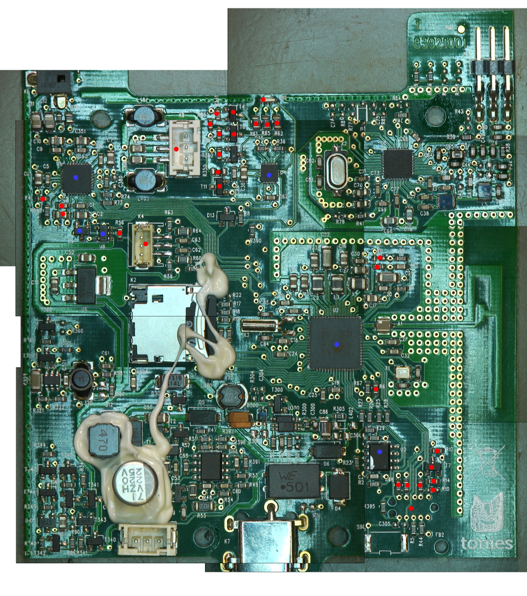
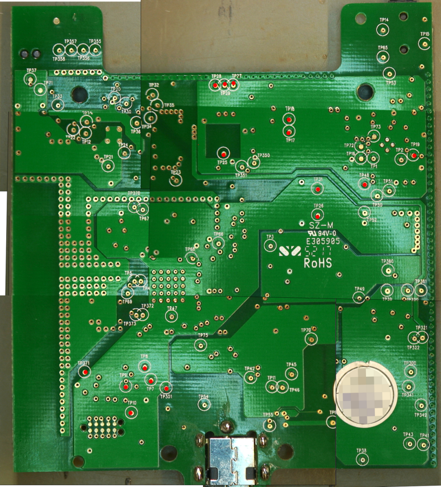

# Toniebox PCB

Repository which will lead to a complete schematic of a Toniebox PCB. The schematic is done with KiCad.

View this project on [CADLAB.io](https://cadlab.io/project/2472). 

Source of CC3200 footprint: https://raw.githubusercontent.com/Turegano/CC3200/master/lib/CC3200.lib

## Table Of Contents
- [Toniebox PCB](#toniebox-pcb)
  - [Table Of Contents](#table-of-contents)
  - [Folders](#folders)
  - [Status](#status)
  - [Testpoints](#testpoints)

## Folders

* [datasheets](datasheets/)
* [doc](doc/): documentation
* [library](library/): KiCad libraries

## Status

* red dot: fully documented
* blue dot: partially documented

### Remaining Work

* create subsheets for logical blocks
* create pinout of ASICs
* document remaining testpoints
  

## Testpoints

| TP    | Connected to                                                                                                                            | Comment                                                                                                                                                                                                        |
| ----- | --------------------------------------------------------------------------------------------------------------------------------------- | -------------------------------------------------------------------------------------------------------------------------------------------------------------------------------------------------------------- |
| TP1   | U1 MCLK                                                                                                                                 | external master clock                                                                                                                                                                                          |
| TP2   | U1 GPIO1/ U2 pin 55 GPIO1                                                                                                               |                                                                                                                                                                                                                |
| TP3   | K2 pin 9                                                                                                                                | SD detect                                                                                                                                                                                                      |
| TP4   | U2 pin 29                                                                                                                               | ANT SEL1 Antenna Selection Control                                                                                                                                                                             |
| TP5   | U2 pin 30                                                                                                                               | ANT SEL2 Antenna Selection Control                                                                                                                                                                             |
| TP6   | BQ24400 GND/Battery GND                                                                                                                 | Battery GND is connected with PCB GND via R55 (0R05)                                                                                                                                                           |
| TP7   | U2 pin 11/U3 pin 6/R27(?)                                                                                                               | SCK                                                                                                                                                                                                            |
| TP8   | U2 pin 12/U3 pin 5/R26(?)                                                                                                               | SI                                                                                                                                                                                                             |
| TP9   | U2 pin 13/U3 pin 2/R25(?)                                                                                                               | SO                                                                                                                                                                                                             |
| TP10  | U2 pin 14/U3 pin 8/R28(?)                                                                                                               | VCC                                                                                                                                                                                                            |
| TP11  | BQ24400 pin 3                                                                                                                           | Charge status LED, connected to U6 output via 100k pull up and U2 pin 20 via 1k2                                                                                                                               |
| TP12  | U5 ASK/OOK                                                                                                                              | can be configured as an output to provide the received analog signal output                                                                                                                                    |
| TP14  | audio jack                                                                                                                              |                                                                                                                                                                                                                |
| TP15  | audio jack                                                                                                                              |                                                                                                                                                                                                                |
| TP16  | U1 VOL/MICDETECT                                                                                                                        |                                                                                                                                                                                                                |
| TP17  | K9 pin 3/U1                                                                                                                             | speaker+                                                                                                                                                                                                       |
| TP18  | K9 pin 2/U1                                                                                                                             | speaker-                                                                                                                                                                                                       |
| TP19  | U1 pin 31/D12/U2 pin 62 GPIO7/U5 EN                                                                                                     | DAC reset                                                                                                                                                                                                      |
| TP20  | U5 VDD_X                                                                                                                                |                                                                                                                                                                                                                |
| TP21  | U5 VDD                                                                                                                                  |                                                                                                                                                                                                                |
| TP22  | U5 BG                                                                                                                                   |                                                                                                                                                                                                                |
| TP23  | U5 VIN                                                                                                                                  | Voltage of U320, if faulty check TP321                                                                                                                                                                         |
| TP24  | U5 VDD_A                                                                                                                                |                                                                                                                                                                                                                |
| TP25  | U4 pin 3                                                                                                                                | Accelerometer DNC                                                                                                                                                                                              |
| TP26  | K4 pin 1/U2 pin 57/R60 (1k)(?)/R394 (1k2)(?)/                                                                                           | ears, fed from regulator U6/TP52                                                                                                                                                                               |
| TP27  | D10 pin 1                                                                                                                               | LED red -                                                                                                                                                                                                      |
| TP28  | D10 pin 2                                                                                                                               | LED green -                                                                                                                                                                                                    |
| TP29  | D10 pin 3                                                                                                                               | LED blue -                                                                                                                                                                                                     |
| TP30  | U5 IO 5                                                                                                                                 |                                                                                                                                                                                                                |
| TP31  | K4 pin 3/U2 pin 59/R64(1k)(?)                                                                                                           | ears, fed from regulator U6/TP52                                                                                                                                                                               |
| TP32  |                                                                                                                                         |                                                                                                                                                                                                                |
| TP33  | U5 MOD                                                                                                                                  |                                                                                                                                                                                                                |
| TP34  | U5 SYS                                                                                                                                  |                                                                                                                                                                                                                |
| TP35  | U5 EN                                                                                                                                   | When high NFC IC is enabled. If faulty check TP19. Fed by U8 via D13 (is connected to U2 GPIO7).                                                                                                               |
| TP36  | U5 EN2                                                                                                                                  |                                                                                                                                                                                                                |
| TP37  | NFC socket                                                                                                                              |                                                                                                                                                                                                                |
| TP38  | K8 pin 3/T1/D12 (battery control circuit)/T340/T342                                                                                     | bat+                                                                                                                                                                                                           |
| TP39  | U320 VIN, T320 collector voltage for U320 EN via R320; U6 VIN; U8 VIN                                                                   | feeds U320, U6, U8 with VCC; enables U320 via T320                                                                                                                                                             |
| TP41  | Circuit next to U10                                                                                                                     | 0V w/o battery, ~ bat. Voltage w/ battery; output of T344; connected to U10; controls  T343, T342, T340                                                                                                        |
| TP42  | BQ24400 BAT input                                                                                                                       |                                                                                                                                                                                                                |
| TP43  | U10 /                                                                                                                                   | battery voltage after R89; w/ battery: voltage < bat voltage; w/ power supply 3.8 – 4.4V; check TP38 if not ok                                                                                                 |
| TP45  | K8 pin 1                                                                                                                                | temp sense; connected via R47 with BQ24400 and battery NTC.                                                                                                                                                    |
| TP46  | BQ24400 TIMER PROGRAM                                                                                                                   |                                                                                                                                                                                                                |
| TP47  | U2 pin 8/output L300 via 1:1 voltage divider R75/R72                                                                                    | Supervising U300+circuitry; measured between D301 and L300; 50% voltage via divider R75/R72 to U2 pin 8                                                                                                        |
| TP48  | U2 pin 61/U8 ENABLE via R56 (10k pulldown)                                                                                              | U2 enables LDO U8 with GPIO6. If U8 is not working (TP50) check U8 at TP39                                                                                                                                     |
| TP49  | U2 pin 60                                                                                                                               |                                                                                                                                                                                                                |
| TP50  | U8 VOUT/U9 VIN/U1 IOVDD/U1 HPVDD/SPKVDD/AVDD                                                                                            | 3V3 output of LDO U8, 1V8 input of LDO U9, T11, U4. 3V3 input U1; if not ok check TP48.                                                                                                                        |
| TP51  | U9 VOUT/U1 DVDP                                                                                                                         | 1V8 output of LDO U9. Feeds  U1 at PIN 3; if not ok check ENABLE at TP50 and input voltage at TP39.                                                                                                            |
| TP52  | U6 VOUT 3V3/ U2 VIN IO1, VIN IO2, VIN DCDC ANA, VIN DCDC PA, VIN DCDC DIG, VD2 ANA2/ VCC for U3,T7, T360, T320, SV BQ24400 LED/ RGB LED | 3V3 output LDO U6: feeds U2, U3, T360 (TP360), TP320, LED output of BQ24400 (TP11)                                                                                                                             |
| TP53  | audio jack                                                                                                                              |                                                                                                                                                                                                                |
| TP54  | VCC                                                                                                                                     | Power supply voltage; if power supply is ok check L8 (SMT Common Mode Line Filter 2x500mH)  and D4 (15V TVS Diode)                                                                                             |
| TP55  | BQ24400 GND/GND power jack                                                                                                              |                                                                                                                                                                                                                |
| TP65  | audio jack                                                                                                                              |                                                                                                                                                                                                                |
| TP66  | U2 pin 43/pin 9/pin 56                                                                                                                  | U2 internal voltage                                                                                                                                                                                            |
| TP67  | U2 pin 38/pin 36/pin 48/pin 25                                                                                                          | U2 internal voltage                                                                                                                                                                                            |
| TP68  | U2 pin 48                                                                                                                               | U2 internal voltage                                                                                                                                                                                            |
| TP69  | U2 pin 24                                                                                                                               | U2 internal voltage                                                                                                                                                                                            |
| TP70  | T9                                                                                                                                      | middle pin (SMD 13014)                                                                                                                                                                                         |
| TP71  | U5 VSS PA/VSS RF/VSS/VSS D/NFC connector outer contacts                                                                                 |                                                                                                                                                                                                                |
| TP72  | U1 AIN1                                                                                                                                 |                                                                                                                                                                                                                |
| TP73  | U1 AIN2                                                                                                                                 |                                                                                                                                                                                                                |
| TP74  | U5 IRQ                                                                                                                                  |                                                                                                                                                                                                                |
| TP75  | U300 VIN                                                                                                                                | comes from R305 (0R). U300 generates voltage when operating with power supply; if not ok check TP301                                                                                                           |
| TP300 | U300 ISENS/T347 via R344                                                                                                                | U300 output voltage; main supply when connected to power supply; input voltage of voltage divider R344/R345 for U10.                                                                                           |
| TP301 | D6                                                                                                                                      | Main voltage after D6;if not ok check TP54                                                                                                                                                                     |
| TP320 | U320 ENABLE/T320                                                                                                                        | ENABLE U320 from T320; T320 is supplied via R320 (470k) from D301 (TP39); T320 is controlled by U2 pin 58; if not ok check TP361 and supply voltage of TP39                                                    |
| TP321 | U320 output/U5 input                                                                                                                    | U320 supplies U5; if not ok check TP320 and TP39 for supply voltage; if supply voltage check TP322                                                                                                             |
| TP322 | U320 feedback                                                                                                                           | Voltage for regulating output voltage of U320; output voltage of divider R321 (470k)/R322 (180k); should be 1.31V-1.51V; divider is fed by U320 output; if not ok check output TP321, input TP39, ENABLE TP320 |
| TP341 | U10 circuitry                                                                                                                           | ;output of T347; controls T346, T345, T341;  LOW when operating with power supply; ~ bat voltage when operating with battery; check TP342 and TP38                                                             |
| TP342 | U10 circuitry/voltage divider R344/R345                                                                                                 | Voltage divider R344/R345; fed from output of U300; triggers T344, T347 getriggert; operating with power supply: 1V; battery mode: 0V;check  TP300                                                             |
| TP350 | U2 pin 3                                                                                                                                | I2C_SCL                                                                                                                                                                                                        |
| TP351 | U2 pin 4                                                                                                                                | I2C_SDA                                                                                                                                                                                                        |
| TP355 | config(?) R connected to GND                                                                                                            |                                                                                                                                                                                                                |
| TP356 | config(?) R connected to GND                                                                                                            |                                                                                                                                                                                                                |
| TP357 | config(?) R connected to GND                                                                                                            |                                                                                                                                                                                                                |
| TP358 | config(?) R connected to GND                                                                                                            |                                                                                                                                                                                                                |
| TP360 | K2 pin4                                                                                                                                 | SD VDD;T360 switches  3V3 of U6; T360 is controlled by  U2 GPIO3 PIN58;  check TP361                                                                                                                           |
| TP361 | T320/T360 (voltage)                                                                                                                     | T320 switches ENABLE of U320 / T360 controls voltage SD card                                                                                                                                                   |
| TP370 | U2 pin 34 SOP1                                                                                                                          |                                                                                                                                                                                                                |
| TP371 | U2 pin 35 SOP0                                                                                                                          |                                                                                                                                                                                                                |
| TP372 | U2 pin 17 TDO                                                                                                                           |                                                                                                                                                                                                                |
| TP373 | U2 pin 18                                                                                                                               |                                                                                                                                                                                                                |
